# Laravel REST API - Architecture & System Design

## Table of Contents
1. [System Architecture](#system-architecture)
2. [Entity-Relationship Diagram](#entity-relationship-diagram)
3. [Authentication & Authorization Flow](#authentication--authorization-flow)
4. [API Endpoint Hierarchy](#api-endpoint-hierarchy)
5. [Request-Response Flow](#request-response-flow)
6. [Deployment Architecture](#deployment-architecture)
7. [Data Flow Diagrams](#data-flow-diagrams)
8. [Component Interaction](#component-interaction)
9. [Implementation Roadmap](#implementation-roadmap)

---

## System Architecture

### High-Level Overview
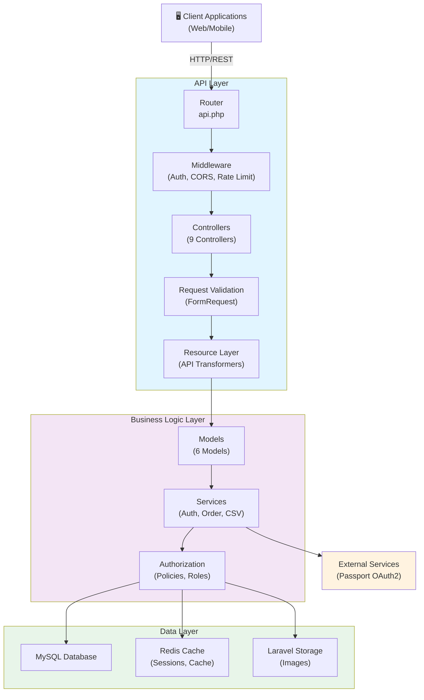

---

## Entity-Relationship Diagram

### Database Schema
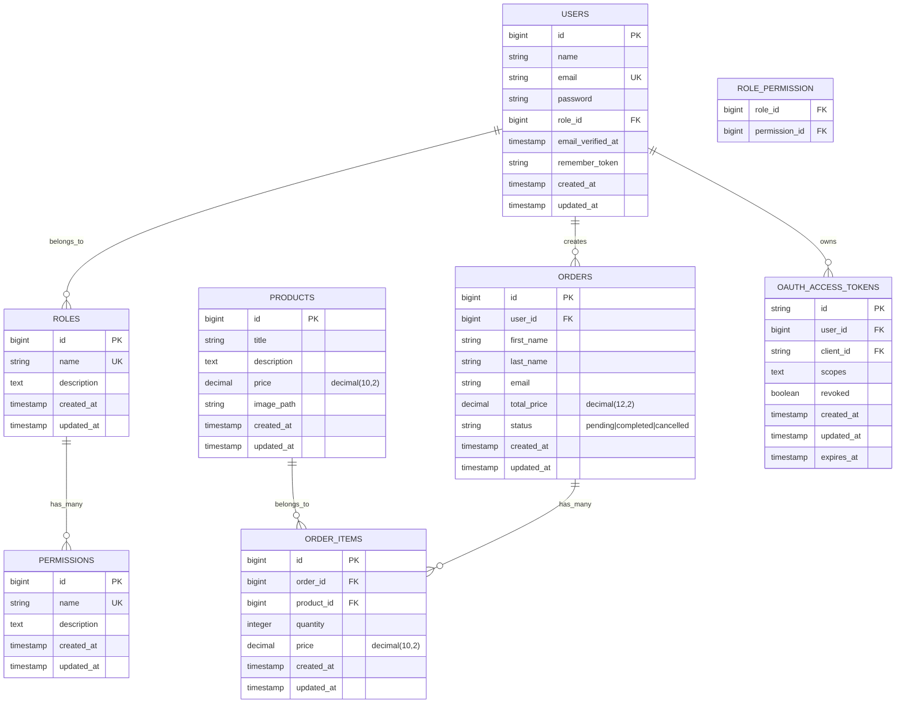

---

## Authentication & Authorization Flow

### JWT Authentication Flow with Laravel Passport
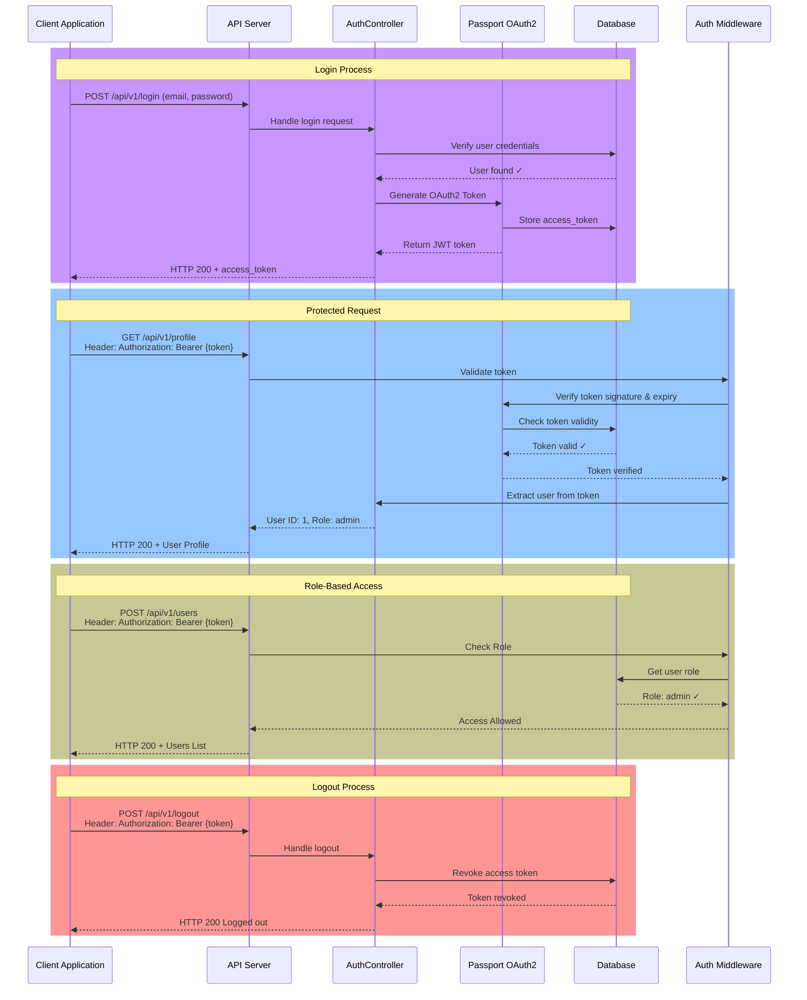

---

## API Endpoint Hierarchy

### Route Structure & Access Control
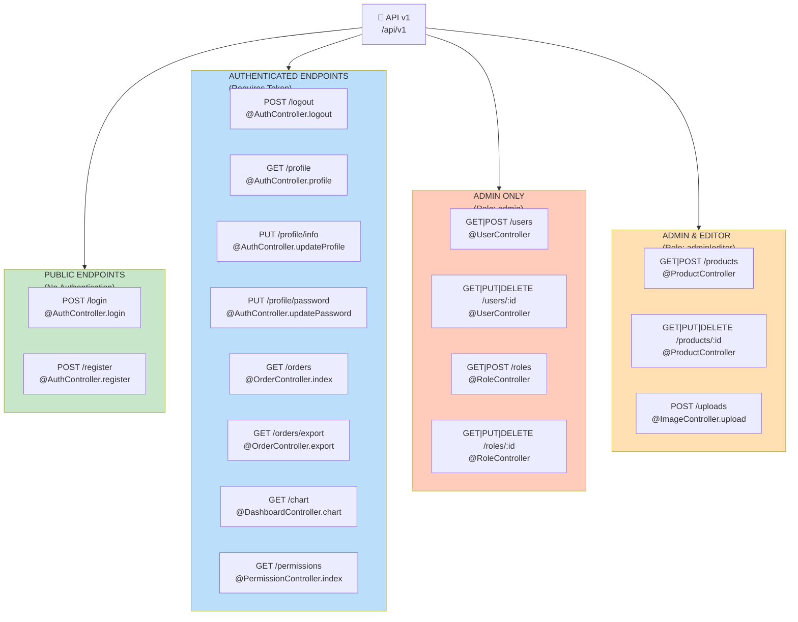

---

## Request-Response Flow

### Typical Order Creation Flow
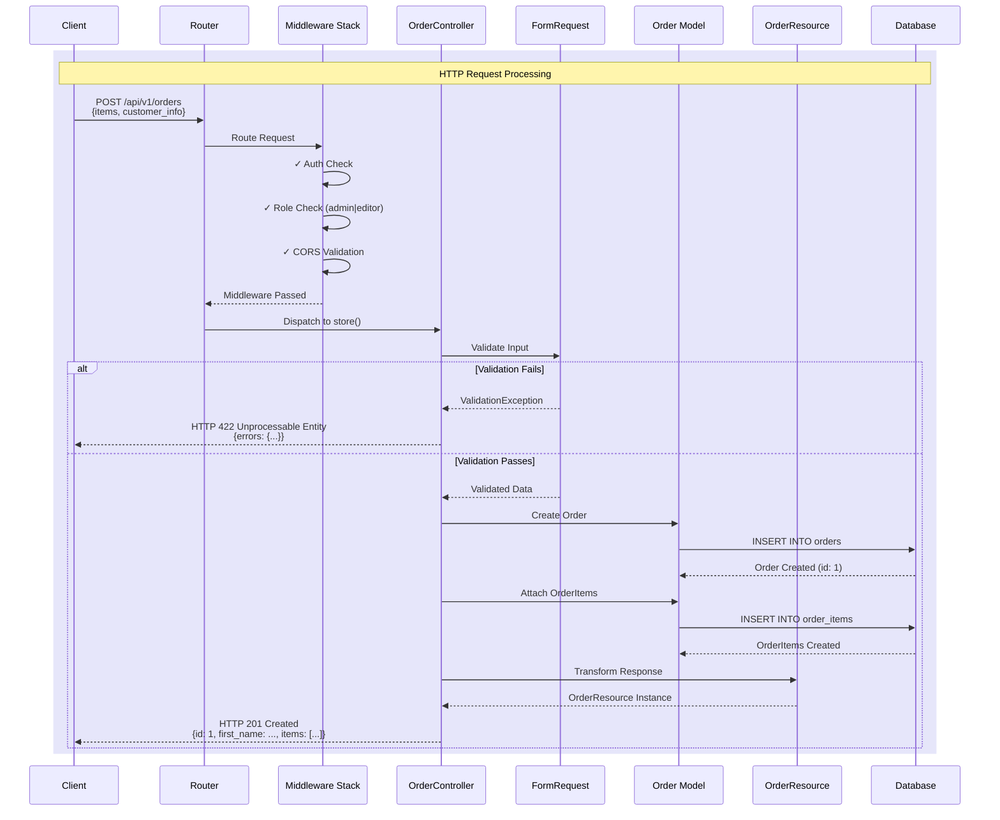

### Data Transformation Pipeline
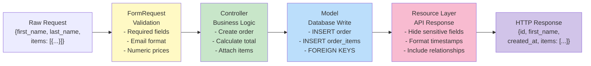

---

## Deployment Architecture

### Docker Container Architecture
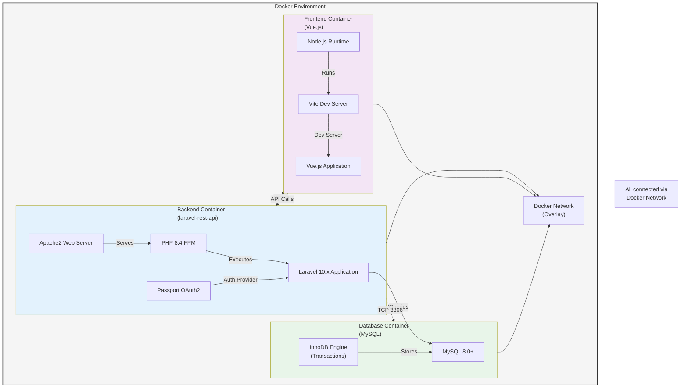

### Development vs Production Deployment
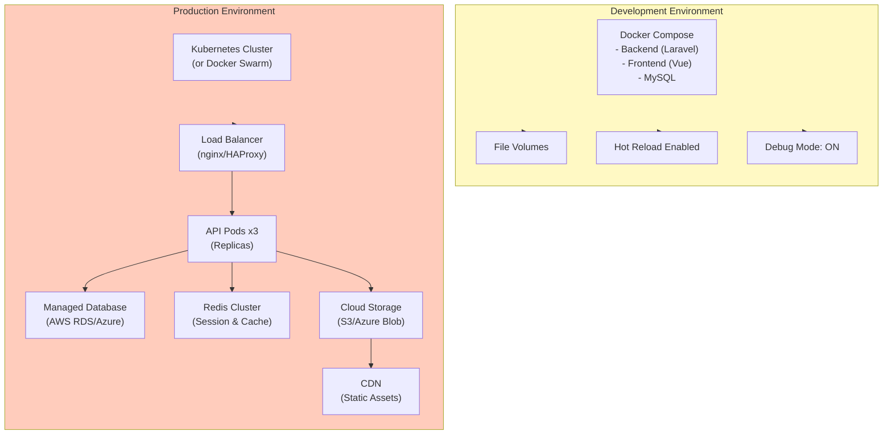

---

## Data Flow Diagrams

### Authentication Token Flow
```mermaid
flowchart TD
    A["User Credentials<br/>(email, password)"] --> B["POST /api/v1/login"]
    B --> C["Hash Verification"]
    
    alt C1["Invalid"]
        C -->|❌| D["HTTP 401 Unauthorized"]
    else C2["Valid"]
        C -->|✓| E["Passport OAuth2<br/>Token Generator"]
        E --> F["Generate JWT Token<br/>(Header.Payload.Signature)"]
        F --> G["Store in oauth_access_tokens"]
        G --> H["Return Token to Client"]
        H --> I["Client Stores Token<br/>(localStorage/cookie)"]
        I --> J["Include in Request Header<br/>Authorization: Bearer {token}"]
        J --> K["Server Validates Token"]
        K --> L["Extract User & Role Data"]
        L --> M["Process Authenticated Request"]
    end
```

### Role-Based Access Control Flow
```mermaid
flowchart TD
    A["Authenticated Request<br/>/api/v1/users"] --> B["Extract User Role<br/>from Token"]
    
    B --> C["Check Required Role<br/>for Endpoint"]
    
    C -->|Route: admin only| D{"User Role = admin?"}
    C -->|Route: admin|editor| E{"User Role = admin or editor?"}
    
    D -->|Yes ✓| F["Check Permissions<br/>via Spatie"]
    D -->|No ❌| G["HTTP 403 Forbidden"]
    
    E -->|Yes ✓| F
    E -->|No ❌| G
    
    F --> H{"Has Permission<br/>to resource?"}
    H -->|Yes ✓| I["Process Request<br/>Execute Controller"]
    H -->|No ❌| G
    
    I --> J["Return Authorized<br/>Response"]
    G --> K["Return Error Response"]
    
    style D fill:#ffe0b2
    style E fill:#ffe0b2
    style H fill:#ffe0b2
    style I fill:#c8e6c9
    style J fill:#c8e6c9
    style G fill:#ffcdd2
```

### CSV Export Data Flow
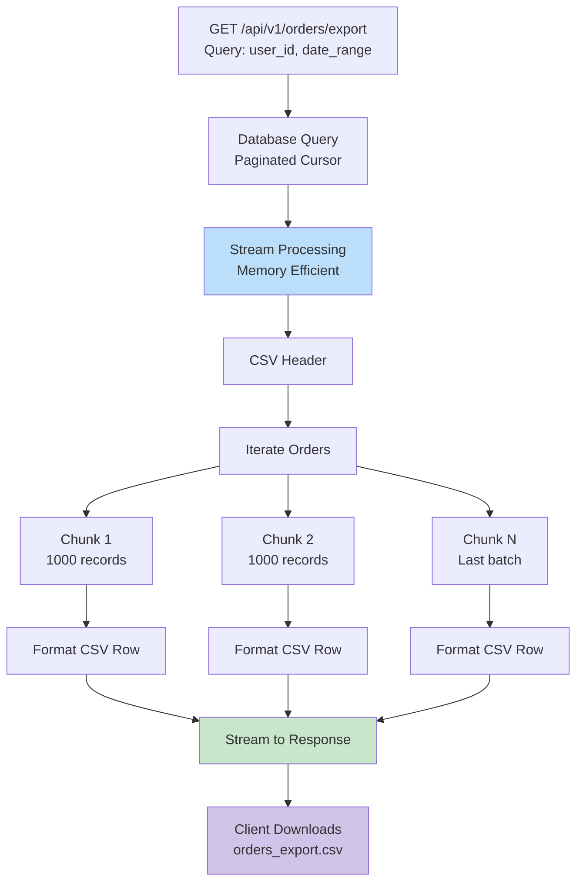

---

## Component Interaction

### MVC Request Lifecycle
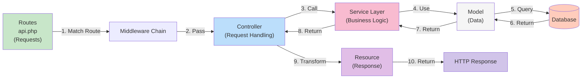

### Authorization System Architecture
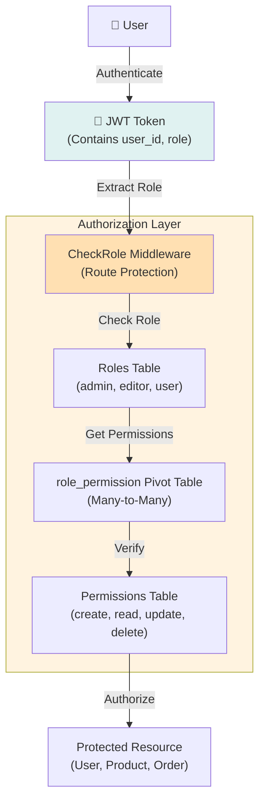

---

## Technology Stack Summary

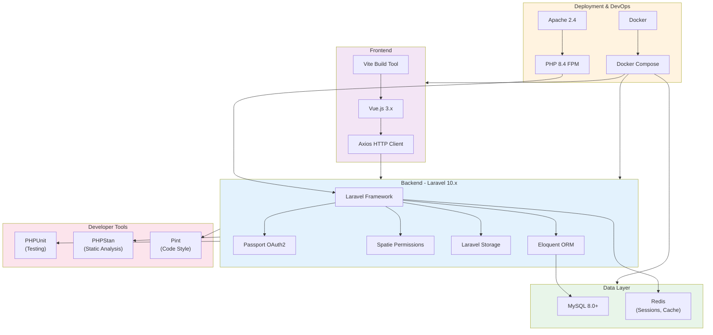

---

## Key Architectural Patterns Used

### 1. **MVC Pattern**
- **Model**: Eloquent ORM models for data representation
- **View**: API Resources for response formatting
- **Controller**: HTTP controllers handling requests

### 2. **Repository Pattern (Implicit)**
- Controllers delegate to Models
- Models encapsulate database logic
- Separation of concerns

### 3. **Resource Pattern**
- API Resources transform models into API responses
- Consistent field allowlisting for security
- Relationship eager-loading optimization

### 4. **Middleware Pattern**
- Authentication middleware (Passport)
- Authorization middleware (CheckRole)
- CORS middleware for cross-origin requests

### 5. **OAuth2 Pattern**
- Laravel Passport implements OAuth2 token-based auth
- JWT tokens with expiration
- Refresh token flow supported

### 6. **Role-Based Access Control (RBAC)**
- Spatie Laravel Permission for role/permission management
- Database-driven authorization
- Flexible permission assignment per role

---

## Security Considerations

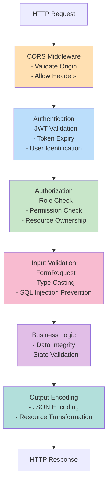

---

## API Response Structure

### Success Response
```json
{
  "success": true,
  "status_code": 200,
  "message": "Operation completed successfully",
  "data": {
    "id": 1,
    "name": "John Doe",
    "email": "john@example.com",
    "role": "admin"
  }
}
```

### Paginated Response
```json
{
  "success": true,
  "status_code": 200,
  "data": [
    { "id": 1, "name": "Product 1", "price": 100 },
    { "id": 2, "name": "Product 2", "price": 150 }
  ],
  "pagination": {
    "current_page": 1,
    "per_page": 15,
    "total": 42,
    "last_page": 3
  }
}
```

### Error Response
```json
{
  "success": false,
  "status_code": 422,
  "message": "Validation failed",
  "errors": {
    "email": ["The email field is required"],
    "password": ["The password must be at least 8 characters"]
  }
}
```

---

## Performance Optimization Strategies

| Strategy | Implementation | Benefit |
|----------|-----------------|---------|
| **Eager Loading** | Using `with()` in Eloquent | Prevents N+1 queries |
| **Pagination** | `paginate()` method | Limits data per request |
| **Cursor Pagination** | Used in CSV export | Memory efficient for large datasets |
| **Caching** | Redis for sessions | Faster auth token lookup |
| **Database Indexing** | On foreign keys, emails | Faster queries |
| **Lazy Loading Prevention** | Resource layer control | Prevents over-fetching |
| **API Resource Filtering** | Explicit field selection | Reduces response size |
| **Compression** | gzip middleware (Apache) | Smaller transfer size |

---

## Future Enhancement Recommendations

### High Priority
- [ ] API Rate Limiting (throttle middleware)
- [ ] Request Logging & Monitoring
- [ ] Webhook System for Events
- [ ] Batch Operations (bulk create/update)
- [ ] Advanced Filtering & Search

### Medium Priority
- [ ] GraphQL API Alternative
- [ ] Soft Deletes for all resources
- [ ] Audit Trail / Change Log
- [ ] Email Notifications
- [ ] Two-Factor Authentication (2FA)

### Low Priority
- [ ] API Versioning (v2)
- [ ] Subscription/Billing System
- [ ] Advanced Analytics
- [ ] Multi-tenancy Support

---

## Testing Strategy

### Test Coverage Structure
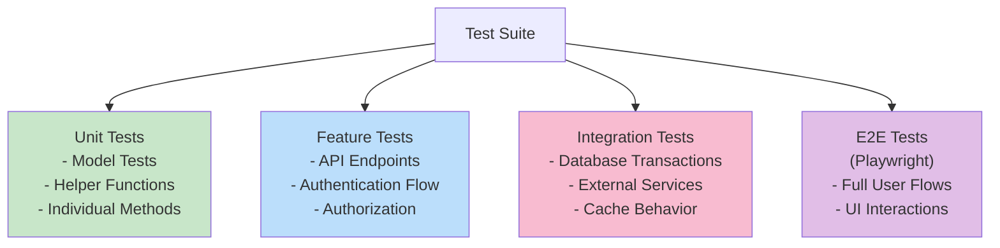

---

## Documentation & Resources

- **Postman Collection**: Import API endpoints for testing
- **Database Schema**: Run migrations for complete schema
- **API Response Examples**: See `docs/` folder
- **Environment Setup**: Check `.env.example` for configuration

---

## Implementation Roadmap

This roadmap evolves the current Laravel API into a reliable payment platform without introducing microservices before the domain boundaries and operational needs are proven.

### Current Baseline

- Laravel 10 with PHP 8.1 support.
- Laravel Passport authentication.
- Spatie roles and permissions.
- MySQL persistence.
- Synchronous queues by default.
- File-based cache by default.
- Orders and order items exist, but payment transactions and payment states do not yet exist.

### Milestone 1: Stabilize the Existing API

- Establish a passing baseline for authentication, users, products, orders, roles, and permissions.
- Standardize validation, authorization, API responses, and error handling.
- Review API resources so passwords, tokens, and internal fields are never exposed.
- Add indexes for user email, order status, ownership, and foreign keys.
- Add rate limits to login, registration, exports, and future payment endpoints.
- Record architecture decisions before introducing infrastructure dependencies.

**Exit criteria:** existing behavior is covered by tests and regressions are visible before payment work begins.

### Milestone 2: Create the Payment Domain

Add a payment module inside the monolith with clear ownership of payment behavior.

Core concepts:

- Payment
- Payment attempt
- Refund
- Payment webhook
- Payment method
- Payment provider

Payment data should include the order, amount, currency, provider, provider transaction ID, internal status, provider status, idempotency key, failure reason, and timestamps.

Keep order status and payment status separate. Use controlled payment states such as `created`, `pending`, `requires_action`, `authorized`, `paid`, `failed`, `cancelled`, `refunded`, and `partially_refunded`.

**Exit criteria:** payment state transitions and database ownership are documented before provider integrations are added.

### Milestone 3: Integrate One Payment Provider

Implement one provider end to end in sandbox mode before adding PayPal, cards, Vodafone Cash, and InstaPay.

Each provider must implement the same application-facing capabilities:

- Create payment.
- Confirm payment.
- Query payment status.
- Refund payment.
- Verify webhook signatures.
- Translate provider statuses into internal statuses.

Use adapters so controllers and order logic do not contain provider-specific code.

**Exit criteria:** successful, failed, cancelled, duplicate, timeout, and webhook-retry scenarios are tested for the first provider.

### Milestone 4: Secure Payment and Password Workflows

- Never store raw card numbers, CVV, or full card credentials.
- Use hosted checkout or provider tokenization for card payments.
- Verify webhook signatures and compare webhook amounts with the original order.
- Require idempotency keys to prevent duplicate charges.
- Require current password and confirmation when a user changes their own password.
- Restrict role changes, refunds, and administrative payment actions with explicit permissions.
- Add audit records for payment, password, email, role, refund, and authentication changes.

**Exit criteria:** sensitive operations have authorization tests, audit coverage, and no secret or payment data in logs or API responses.

### Milestone 5: Connect Payments to Orders

Implement the workflow:

```text
Order created
    -> Payment created
    -> Payment pending
    -> Provider webhook received
    -> Payment verified
    -> Payment marked paid
    -> Order marked paid
    -> Notification dispatched
```

The API must never mark a payment as successful based only on a frontend redirect. Provider responses and signed webhooks must be verified server-side.

**Exit criteria:** order/payment integration tests prove that payment creation, confirmation, failure, refund, and duplicate callbacks are handled safely.

### Milestone 6: Introduce Asynchronous Processing

Move from the default synchronous queue to Redis queues or RabbitMQ for:

- Webhook processing.
- Provider retries.
- Notifications.
- Refund processing.
- Payment reconciliation.
- Report and export work.

Add domain events such as `PaymentCreated`, `PaymentSucceeded`, `PaymentFailed`, `PaymentRefunded`, and `PaymentWebhookReceived`.

Add retry policies, backoff, failed-job handling, dead-letter behavior, idempotent consumers, distributed locks, and a transactional outbox.

RabbitMQ is the recommended first broker for business jobs and routing. Introduce Kafka only when event volume, replay requirements, analytics, or multiple independent consumers justify it.

**Exit criteria:** asynchronous operations can be retried without duplicate charges or inconsistent order state.

### Milestone 7: Refactor Toward Clean Architecture

Organize new code by business capability:

```text
Domain
    User, Order, Payment, Catalog

Application
    Use cases and commands

Infrastructure
    Database, providers, queues, cache, external APIs

Presentation
    Controllers, requests, resources, webhooks
```

Controllers should coordinate HTTP requests only. Application services should execute use cases. Domain code should own business rules. Provider adapters should own external API behavior.

Use Strategy/Adapter for providers, State for payment transitions, commands for use cases, events for completed facts, and the Outbox pattern for reliable event publication. Add repositories only where they protect a meaningful boundary or improve testing.

**Exit criteria:** payment behavior can be tested without calling a real provider, and provider changes do not require rewriting controllers or order rules.

### Milestone 8: Cache and Performance

- Move shared production cache from file storage to Redis.
- Cache product reads, roles/permissions, dashboard summaries, and short-lived payment status reads where safe.
- Prevent N+1 queries and add missing indexes.
- Keep exports and long-running work asynchronous.
- Measure API latency, database time, queue latency, provider latency, cache hit rate, and error rate.
- Establish a load-test baseline before claiming performance improvements.

Do not cache payment authorization decisions or sensitive data without an explicit expiry and invalidation strategy.

**Exit criteria:** the slowest endpoints have measured before/after results and defined p95 latency targets.

### Milestone 9: Observability and Production Readiness

Add structured logs, request IDs, payment correlation IDs, health checks, queue monitoring, database monitoring, provider metrics, and alerts for payment failures, webhook backlog, retry storms, and unusual refund activity.

Track at least:

- Payment success and failure rates.
- Webhook processing time.
- Duplicate payment attempts.
- Refund rate.
- Queue depth.
- API p95 latency.
- Slow database queries.

**Exit criteria:** a failed payment or delayed webhook can be traced from API request to provider response and database state.

### Milestone 10: Selective Service Extraction

Only extract services after the modular monolith has stable boundaries and measured scaling pressure.

Possible future services are Identity, Order, Payment, Catalog, Notification, and Reporting. Payment is the strongest first extraction candidate because it has external providers, security boundaries, and independent asynchronous workloads.

An extracted service must own its database, expose an explicit API or event contract, define authentication and retry behavior, and never share direct table writes with another service.

AWS Lambda can be evaluated later for isolated webhook, reconciliation, notification, or scheduled workloads. It should not be adopted as a general performance solution without measuring cold starts, database connections, cost, and operational complexity.

### Recommended Delivery Order

```text
Baseline tests and security
    -> Payment domain and migrations
    -> One provider in sandbox
    -> Webhooks, idempotency, refunds
    -> Redis and asynchronous jobs
    -> Additional providers
    -> Performance and observability
    -> Selective service extraction
```

---

**Last Updated**: 2026-08-14  
**Architecture Version**: 1.0  
**Framework Version**: Laravel 10.x
